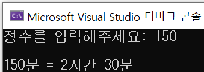

# [C] 1주차 HW

**Q1. Hello, World!를 출력하는 프로그램을 작성** 

:computer: [정답 코드](../hw01.c) 

---

**Q2. 생년월일을 입력받아 출력하는 프로그램을 작성** 

 :computer: [정답 코드](~/week1/hw02.c) 

---

**Q3. 두 정수를 입력받아 사칙연산을 수행하는 프로그램을 작성** 

:computer: [정답 코드](~/week1/hw03.c) 

---

**Q4. 두 정수를 입력받아 몫과 나머지를 구하는 프로그램을 작성** 

:computer: [정답 코드](~/week1/hw04.c) 

---

**Q5. 분을 입력하면 시간+분으로 출력하는 프로그램을 작성** 

:computer: [정답 코드](~/week1/hw05.c) 

---

**Q6. 입력받은 두 정수의 비율을 백분율(정수)로 출력하는 프로그램을 작성** 

:computer: [정답 코드](~/week1/hw06.c) 

---

**Q7. 자판기 거스름돈 계산 프로그램을 작성** 

:computer: [정답 코드](~/week1/hw07.c) 

---

**Q8. short 자료형의 크기와 표현 범위를 출력하는 프로그램을 작성 (sizeof함수, pow함수 사용)** 

:computer: [정답 코드](~/week1/hw08.c) 

---

**Q9. 문자 1개를 입력받고, 해당 문자의 아스키 코드를 출력하는 프로그램을 작성** 

:computer: [정답 코드](~/week1/hw09.c) 

---

**Q10. 대문자 1개를 입력받고, 해당 대문자를 소문자로 바꿔서 출력하는 프로그램을 작성** 

:computer: [정답 코드](~/week1/hw10.c) 

---

**Q11. 숫자 13을 각각 10진수, 8진수, 16진수로 출력하는 프로그램을 작성** 

:computer: [정답 코드](~/week1/hw11.c) 

---

**Q12. 원의 반지름을 실수값으로 입력받고, 면적을 실수값으로 출력하는 프로그램을 작성 
(이 때 원주율은 상수로 정의해 사용한다, 소수점 둘째자리까지 출력)** 

:computer: [정답 코드](~/week1/hw12.c) 

---

**Q13. 윗변, 아랫변, 높이를 입력받아 사다리꼴의 면적을 출력하는 프로그램을 작성 
(윗변, 아랫변 높이는 정수로 입력받고, 면적은 실수로 소수점 첫째자리까지 출력한다)** 

:computer: [정답 코드](~/week1/hw13.c) 

---

**Q14. 세 정수를 입력받아 평균값을 실수로 출력하는 프로그램을 작성 
(소수점 둘째 자리까지 출력)** 

:computer: [정답 코드](~/week1/hw14.c) 

---

**Q15. 키와 몸무게를 실수로 입력받아 BMI값을 실수로 출력하는 프로그램을 작성 
(BMI = 몸무게(kg) / 키(m)^2, 이고 BMI는 소수 둘째자리까지 출력)** 

:computer: [정답 코드](~/week1/hw15.c) 

---